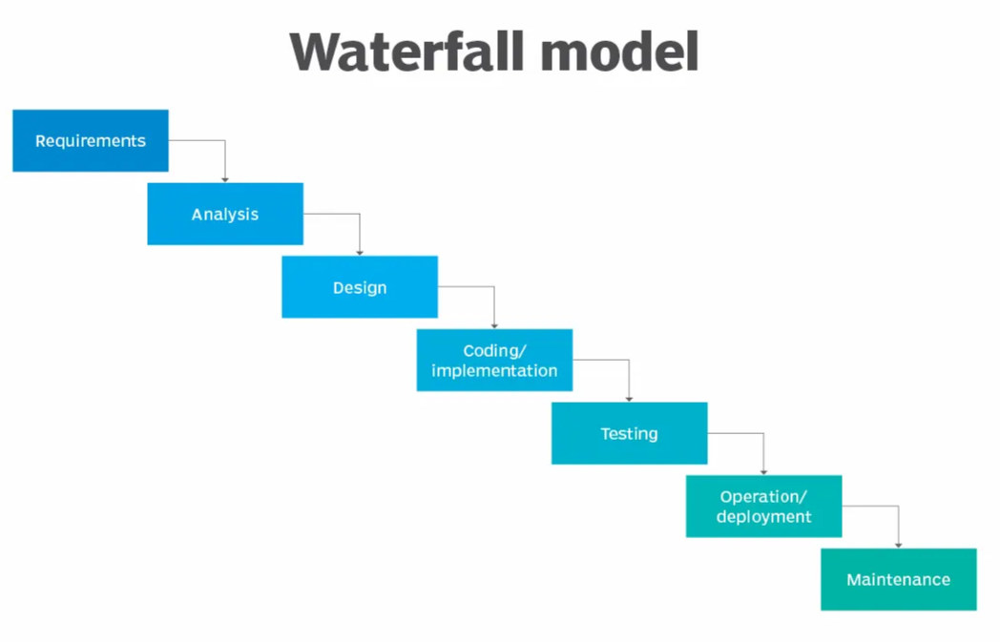
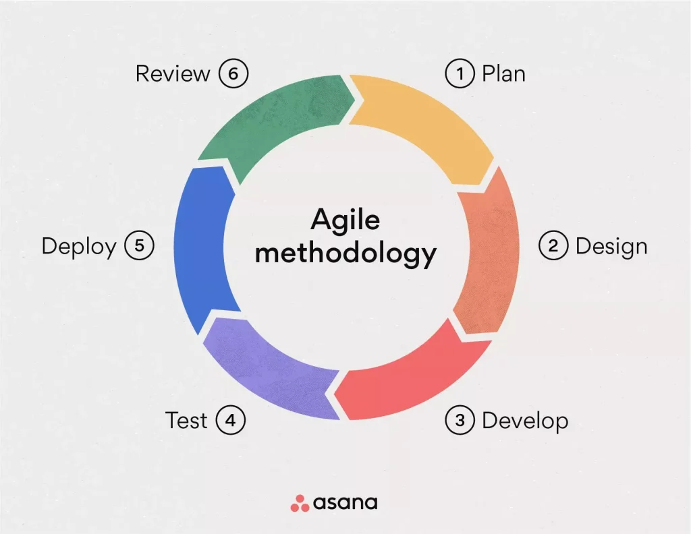

# Quality Assurance from scratch

# Quality Assurance from scratch

---

## 1/ What is QA and where it is needed

### Overview

**QA** – Stands for quality assurance. Goal of QA is to verify that specified requirements are met.

**QA Engineer's duties** may vary depending on the product. But main goal is to make sure that the product meets requirements and has as few bugs as possible.

### What QA Engineers Test

Almost anything that has code in it:

- Coffee makers
- X-rays
- Web apps
- Smart devices
- Routers
- Connectivity
- Localization
- Games
- Mobile
- Cars
- Toasters

*The more products developed, and the more products are on the market that have code and require ongoing support the more QA jobs are out there.*

### Who Hires QA Engineers?

Almost every modern industry. Small startups and big corporation alike:

- Banking
- Real estate
- Gambling
- Government
- Medical
- Gaming
- And many more...

### Why Hire QA Engineers?

> Bugs in product may cost millions and will turn away users towards competition. Bugs may even put companies out of business. Bugs may harm end users. Imagine road navigation app taking you somewhere else or x-ray machine giving to much radiation.
> 

### QA Engineer Activities

- Estimate, prioritize, plan and coordinate testing activities
- Review requirements specifications based on them create test plans and test cases
- Perform testing, make sure product meets expectations & acceptance criteria Gather, analyze and report test results
- Open bug reports and verify they are fixed
- Build test beds, configure environments required for testing
- Participate in meetings, grooming and other team activities
- Serve as a connection layer between developers and product owners
- Add user perceptive to requirements and suggest improvements

### Why Choose QA?

✅ A lot of different industries to work in
✅ Good entry point into IT field
✅ Great benefits, competitive salary, comfortable working env, WFH
✅ A lot of growth potential into QA Automation, SDET, DevOps, PM, Management

---

## 2/ Development Methodologies

### SDLC (Software Development Life Cycle)

<aside>
📋

**SDLC** - Software Development Life Cycle: A structured approach to software development that originated in 1960s to help develop large scale systems.

</aside>

**The 7 Stages:**

1. **Planning** – define goal of the project, estimation of costs and timeline
2. **Analysis** – analyze need for product and develop user requirements. Functional requirements documentation
3. **Design** – How it will be built? Detailed system design documentation created
4. **Development** – Project setup, installing environments, database creation and coding
5. **Verification** – Verify product against requirements. Bug fixes. Test analysis and reports
6. **Deployment** – Deploying to production environment and resolution of production issues
7. **Maintenance** – System updates, patches, customer bug fixes

*SDLC originated in 1960s when computers were created and managed by large corporations like IBM and could be the size of a room. They were mainly designed for large-scale scientific and technological applications.*

---

### WATERFALL

**WATERFALL** – One of the first SDLC models. Waterfall model name appeared around 1970s.

Waterfall development model looks very similar to classic SDLC.

### Stages of Waterfall Model

1. **Creating requirements** – product requirements documentation (PRD) created. What problem product is solving and what resources are required to do it?
2. **Design** – software requirements analysis, modeling architecture. Well design systems add to quality, reliability, security, performance of the product
3. **Coding** – building actual product based on the system design. Creating things that do stuff
4. **Integration and Testing** – bringing component together. Verification that product meets requirements. In this stage QA engineers open bugs, developers fix them, and QA engineers verify that they are indeed fixed and there are no regressions
5. **Operations** – deployment, support, maintenance of complete systems. User found issues fixed, updates, patches, system monitoring and live product related activities

> I like to envision waterfall model as a staircase with a set of steps. Each step takes some time to complete. And once product is out only maintenance remains.
> 

*You might find online that last stages of waterfall model are deployment and maintenance, but in original model they are part of operations.*

########waterfall image#######



### Advantages

✅ Well planned and documented
✅ Clearly defined stages
✅ Structured approach
✅ Requirements are set in place
✅ Mostly monolithic applications
✅ Realistic estimates, dates, contracts
✅ Good for regulated industries, big corporations

### Disadvantages

❌ Hard to update requirements
❌ Going back to previous stages is almost impossible or very expensive
❌ Most testing comes after development
❌ No feedback from users
❌ Does not fit well in competitive and changing market
❌ High risk if product fails

<aside>
💡

In real life it is hard to find pure waterfall or as a matter of fact any other approach, most places use their own interpretation of the development methodologies with some hybrid practices in place.

</aside>

---

### AGILE

**AGILE** – is relativity new software development methodology that was established in 2001

Agile Manifesto has ideas build in that allow agile to be responsive to change, link to manifesto and principles: [https://agilemanifesto.org/](https://agilemanifesto.org/)

World has changed since Waterfall appeared, now more and more companies are startups that compete for the market share and can't afford being rigid like waterfall. They must change and adapt; they need to present MVP to investors and get new round of funding going.

**MVP** – Minimum Viable Product, something that has minimum functionality and provides proof of concept. Further direction of product can be adjusted if needed.

Since Agile appeared it branch out into many different forms, like scrum, shift right and others. But they all have the same approach of continuous incremental improvement through small and frequent releases.

There is no exit like in waterfall as long as product is viable and in demand it will adapt and improve, backlog (list of features to work on) is never empty.

Agile instead of working on complete product in one large cycle, agile has small feature based (called stories) iterations.

Classic Agile can have a release cycle anywhere from two weeks to two months long. It may have different departments and a standard hierarchy with managers over departments.

Classic Agile is flexible. It does not mean there are no documentations or processes in place in agile environment. But the focus is on continues improvement of working product over comprehensive documentation.



########agile image#######

### Advantages

✅ High level of communication between business and development
✅ Customer satisfaction as key indicator of product success
✅ Adaptability to unexpected changes and market challenges
✅ If testing implemented on all stages it will result in better quality of product
✅ Continuous improvement of product

### Disadvantages

❌ Might not serve well in regulated industries
❌ Frequent changes (context switching) can lead to fast burnouts
❌ Limited documentation or no documentation at all. Source of truth can be someone's expertise or even opinion
❌ Fragmented delivery can lead to gaps in integration and unexpected bugs on release

---

### SCRUM

**SCRUM** – is Agile on steroids. Fun fact scrum is not an acronym.

Scrum works in small teams, there is no classical hierarchy. Teams consist of 6 – 9 people that may have different members like: developers, qa, scrum master, product manager, dev ops, designers.

Small self organizing teams work on a selected project and act like special ops of development. With high performance and high delivery speed of features.

All work organized withing sprints. Each sprint last from 2 – 4 weeks, typically 2 weeks. There may be release after each sprint or a planned release after several sprints.

Scrum has a unique role called scrum master with task is to facilitate scrum process.

Scrum has daily morning meetings called stand up. Stand ups last 15 minutes during which each member reports what they are working on today and if there are any blockers.

Visual presentation of scrum in Jira:
[https://alexusadays.atlassian.net/jira/software/projects/LEARN/boards/1/backlog](https://alexusadays.atlassian.net/jira/software/projects/LEARN/boards/1/backlog)

---

### KANBAN / LEAN

**KANBAN** – Lean / Agile method of development with visualization of workflow. Where teams prioritize tasks and complete them by moving thru stages and from one side of the whiteboard to another.

### Lean Principles

1. **Eliminate waste** – not adding value to the customer (bugs, partial work, micromanaging)
2. **Build Quality in** – test early, eliminate as many bugs as possible in early stages
3. **Create Knowledge** – build often and practice small releases. Code reviews, knowledge sharing, documented processes
4. **Delay commitment** – do not commit to design or architecture until assumptions are ruled out and multiple solutions evaluated
5. **Deliver fast** – develop fast, receive feedback and improve based on it. Fail fast and learn from results
6. **Respect people** – self-organized teams, develop leaders, staffed with needed expertise, set reasonable goals
7. **Optimize the whole** – each stage of SDLC should be analyzed with each iteration and optimized and improved thru learning and experience

### Key Ideas on KANBAN

1. Manager flow (identify bottlenecks and estimate effort)
2. Limit work in progress (whip limits)
3. Visible and simple processes
4. Continues feedback
5. Continues improvement

########kanbanimage#######


---

### SHIFT LEFT/RIGHT

**SHIFT LEFT** – Moving testing activities closer to development. Emphasis on problem prevention.

**SHIFT RIGHT** – Moving testing closer to production. Focus on controlled production testing.

############Test Coverage Based on Approach############


### SHIFT LEFT

- Work early on test planning
- Unit testing
- Integration testing
- API testing
- Quality at the center of product planning, design, architecture
- TDD, BDD

### SHIFT RIGHT

- Canary releases
- Feature flagging in code
- Monitoring production logs for errors, response times, load handling
- Large automated regression suites in production

<aside>
ℹ️

This does not mean there is no testing in test environment. There is still regression, e2e and acceptance testing on the UI side. But the focus is shifted.

</aside>

---

## 3/ Types of Testing, Test Plans

### 1/ TYPES OF TESTING

### Black Box, White Box, Gray Box

- **Black Box** – provide input, verify output. No knowledge of the system
- **White Box** – you do know what is going on inside, what are internal functions are. Access to code
- **Gray Box** - mix of black box and white box testing

### Positive, Negative Testing

- **Positive** – also called happy path. Verify what user is supposed to do
- **Negative** – verification of invalid inputs or unexpected user actions and how application handles it

### Functional, Non-Functional

- **Functional** – requirements and acceptance criteria-based testing. Includes: unit testing, regression, integration, user acceptance, localization
- **Non-Functional** – verification of system stability and performance. Includes: stress testing, performance testing, load testing, security testing

---

### Common Testing Types

**Acceptance** – feature is implemented according to business requirements (UAT)

**Regression** – running thru established scenarios after bug fix, deployment or release

**API Testing** – mostly verification of communication between frontend and backend. Application Programming Interface is a middleware that allows different programs to communicate to one another

**Exploratory** – verification that relies on testers bugs discovery approach around applications functionality

**Boundary** – verification of boundary values. For example, verification of accepted age

**Smoke** – preliminary testing to verify major functionality works as expected, before starting other tests

**Beta** – early version verification in production environment. Closed beta limited number of users, public beta is open to all

**Stress testing** – verification of stability, reliability and performance of application under heavy loads or/and prolonged periods of time

**Load** – measuring how system will manage and perform under heavy load volumes over time withing expected limit

**Accessibility** – verification of inclusiveness of application for as many people as possible. Includes speech recognition, reading assistant, special inputs. See The Web Content Accessibility Guidelines (WCAG)

**Localization** – verification of usability, accessibility, content translation for a specific language/region

**Security** – search for system vulnerabilities and exploits, so they can be fixed. For example penetration testing that use different tools to find weakness and imitate attacks. A lot now falls under cyber security that is designed to prevent infiltration, data leaks and cyber attacks

### Dev Testing

**Unit testing** – verification on function level, that should be created by developers along side development effort

**Integration testing** – multiple modules or/and functions combined and verified as group

---

### 2/ TEST PLANS

**Test Plan** – usually is a high-level document that includes test strategy and description of required actions and procedures to ensure that product or system meets its design specifications. Test plan should be based on defined system requirements (PRD, BRD, SRD)

### Test Plan May Include

- Authors, contacts, responsible parties, revisions, versions, table of contents
- General requirements, compliance standards, defined scope of testing, definition of pass/fail
- Strategy for each testing type (acceptance, regression, compliance, accessibility, etc.) and testing activities at each stage of the product's life, test objectives
- Described test environment, test tools, system test configuration, supported systems
- Test diagrams, test flow, pass/fail conditions and actual tests

### Useful Links

**Wiki test plan** - [https://en.wikipedia.org/wiki/Test_plan](https://en.wikipedia.org/wiki/Test_plan)
**Wiki ISO/IEC 29119** - ISO/IEC 29119 - Wikipedia

### A bit more on ISO/IEC/IEEE 29119 series

The purpose of the ISO/IEC/IEEE 29119 series is to define an internationally agreed set of standards for software testing that can be used by any organization when performing any form of software testing and using any life cycle.

Can be purchased here: IEEE SA - Standards Store | IEEE/ISO/IEC 29119-1-2021 ([techstreet.com](http://techstreet.com))

### What happens in reality?

- Test plans are not always used. Mostly in bigger companies with well established QA processes or in regulated industries
- Agile smaller startups often rely on PMs/Client communications and requirements that are recorded within Epics as part of ongoing effort to improve product
- In that case QA practices may be recoded and managed thru QA common knowledge spaces (for examples confluence). Where QA processed are modularized and recorded in different sections. For example, knowledge page with bug template and how to file a bug, how to perform regression or prepare test matrix

#############Test Flow Diagram Example##############


---

## 4/ Bugs and How to Report Them

### What is a bug?

Bug is an error or unintended outcome that is violating acceptance criteria, breaking expected system behavior, undermining integrity or stability of the system.

### It is impossible to have bug free application

Even if you freeze code for the most perfect application the systems it interacts with will change, eventually causing issues and breaking application.

<aside>
⚠️

**But it is important to remember:**

- Product quality should give competitive advantage
- Quality should be an integral part of development process
- All issues should be assessed in timely manner and resolved accordingly
</aside>

Homework to google software bug types.

#############BUG LIFE CYCLE##############


### Components of a bug

**Title** – name of the bug, should be short and descriptive

**ID** – unique identifier for ease of reference, usually autogenerated

**Priority** – how fast the issue needs to be resolved (P0, P1, P2, … )

**Summary** – additional information in description if needed

**Steps to reproduce** – exact steps to trigger the issue

**Expected results** – what should happen according to AC (BRD)

**Actual results** – description of issue observed

**Environment** – system and conditions under which issue happened

**Logs** – screenshots, videos, stack trace, console output

---

## 5/ Managing Test Cases and Docs

### 1/ CHECKLISTS & TEST CASES

### Checklist

Checklist is a high-level test document. Checklist should include modularized list of expected verifications. Test list should include what needs to be test, expected outcomes, results of verification.

Checklist can be composed out of end-to-end flows for specific features.

### Test Case

Set of steps to verify correct functionality of an application. It may have preconditions, test data, test case id, test case description, test steps, expected results, pass/fail, visual examples.

It is helpful to start working on feature verification by creating checklist first around core features or modules and then expanding this checklist to test cases.

Test cases can be tracked and managed by test matrixes.

**Example: test matrix**

---

### 2/ MANAGING TEST DOC

### Confluence or other team documentation tool

Usually, QA will have its own space. Where QA engineers will store test plans, information for new QA engineers on how to get started, bug template and bug life cycle, diagrams on test flows and list of tools used. One of the popular tools is confluence, but it can be anything even shared QA google drive.

### Test Rail, Test Lodge or other test management tool

Instead of test matrixes companies might have dedicated test management tool. Where QA engineers can add test cases, create test runs and link them to specific stories in Jira or in other project management tool.

**TestLodge:** [https://app.testlodge.com/](https://app.testlodge.com/)
**TestRail:** [https://www.gurock.com/testrail/](https://www.gurock.com/testrail/)

---

## 6/ Basic Console Commands

#############the OS family tree##############


### 1/ WINDOWS CONSOLE - CMD

1. **ipconfig** – Displays network configuration
2. **NETSTAT** – Display all open network connections and listening ports
3. **PING** – Verify IP-level connectivity
4. **CD** – change directory
5. **Systeminfo** – display Windows system information
6. **DIR** – Show content of folder that you are currently working in
7. **Echo text > filename.txt** – create file with specific text
8. **MORE filename.txt** – display the information contained in a text file
9. **DEL filename.txt** – delete file

### Links

**Page to practice:** [https://bellard.org/jslinux/](https://bellard.org/jslinux/)
**Windows commands cheat sheet:** [https://github.com/security-cheatsheet/cmd-command-cheat-sheet](https://github.com/security-cheatsheet/cmd-command-cheat-sheet)

---

### 2/ Linux Commands

1. **pwd** - display the current working directory
2. **mkdir testdirectory** - create drirectory in linux
3. **cd** - change to a different directory
4. **touch** - create a new file
5. **ls** - list the contents of a directory. **ls -a**
6. **cat** - display the contents of a file
7. **vi** – update file content
8. **grep** - search for a pattern in a file: **grep "pattern" file.txt**
9. **tail** - display the last few lines of a file: **tail file.txt**
10. **cp** - copy a file: **cp oldfile.txt newfile.txt**
11. **diff** - compare two files and show the differences: **diff file1.txt file2.txt**
12. **rm** – remove file: **rm file.txt**
13. **chmod** - change file permissions: **chmod 755 [file.sh](http://file.sh)**
14. **find** - find all files with a certain extension in a directory and its subdirectories: **find /path/to/directory -name "*.txt"**
15. **ifconfig** - display network interface information
16. **ping** - test network connectivity by pinging a server: **ping [google.com](http://google.com)**
17. **netstat** - display network connections, routing tables, and interface statistics: **netstat –a**

**Extra find and stop process:**
kill – 9 $(ps aux | grep 'myprocess' | awk '{print $2}')

### Links

[https://docs.google.com/document/d/1pcnhN84b9S4Ng_ZLz8WuwgUzxO8GXXc8/edit?usp=shar](https://docs.google.com/document/d/1pcnhN84b9S4Ng_ZLz8WuwgUzxO8GXXc8/edit?usp=shar)
**Page to practice:** [https://bellard.org/jslinux/](https://bellard.org/jslinux/)

---

### 3/ Networking Intro

**MAC address:**
A unique physical address assigned to a network interface.

**IP address:**
- An IP address is a unique identifier assigned to a device on a network
- An IP address consists of four numbers separated by periods, with each number ranging from 0 to 255 (for example, 192.168.1.100)

**Netmask:**
Devices with the same netmask are considered to be on the same network, while devices with different netmasks are on different networks.

### Example Configuration

**MAC address:** 00:aa:bb:cc:dd:ee
**IP address:** 192.168.1.100
**Netmask:** 255.255.255.0
**Class A:** 255.0.0.0 ⇒ Class A is for networks with more than 65,536 hosts
**Class B:** 255.255.0.0 ⇒ Class B is for networks with 256 to 65,534 hosts
**Class C:** 255.255.255.0 ⇒ Class C is for networks with fewer than 254 hosts

---

## 7/ Git Introduction

Git is a distributed version control system (VCS) designed to help developers track changes to their code over time. With help of git teams can manage and track changes in code, have efficient collaboration, version control, and conflict resolution. Git is installed on a local machine.

<aside>
💡

**In short:** Git is used to track changes and manage code

</aside>

### Git Features

Git provides several features that make it powerful and flexible, including:

- **Collaboration:** Git allows team members on the same codebase (used almost everywhere so you will work with it at some point)
- **Version control:** Git tracks changes (so you can revert if something is broken)
- **Traceability:** Git provides a detailed history of changes made
- **Branching and merging:** Git allows to work in parallel without affecting the main codebase

**Visual tool for git:** Sourcetree
**Git for windows:** [https://git-scm.com/](https://git-scm.com/)

---

### Git and GitHub

**Git and GitHub are related but different tools:**

GitHub is a web-based platform that provides hosting for Git repositories and additional collaboration features. Many developers use both Git and GitHub together to manage their code and collaborate with others on their projects.

[https://github.com/](https://github.com/)

<aside>
💡

**In short:** GitHub is a web site to store projects so others can also work on them.

</aside>

There are other platforms that allow hosting git repositories: GitLab, Bitbucket, SourceForge, etc. They are very similar, once you use one you can get familiar with others fast.

---

### Getting Started with Git

**There are two ways to start working with git:**

1. **Initialize on your local machine:**
**git init**
This will add .git (hidden) folder where git was initialized
2. **Clone repo from GitHub (we will use this one)**
**git clone your_repo**
This will clone your repository from GitHub to specified location and add .git (hidden) folder

---

### Typical Git Flow

1. **Git pull** => get latest files from remote repository to your local repository
2. **Add some changes to the code** => Untracked files in folder
3. **Git add** => files added to staging
4. **Git commit –m "commit message"** => files are added to the HEAD (latest committed version)
5. **Git push** => Will push your changes to the remote repository

Branching helps to work on different features without interruption.

**To create new branch:** **git checkout –b new_branch_name**

#############Git branches##############


---

### Action Plan

1. Create GitHub account
2. Create repository in GitHub
3. Install Git on your local machine
4. Add (clone) repository from GitHub to local Git
5. Setup credentials for GitHub
6. Update local repository and upload (push) it to GitHub
7. Cover some basic git flow

---

### Most Used Commands

1. **git status** => displays the state of the working directory and the staging area
2. **git push** => send you changes upstream
3. **git pull** => get latest changes from remote repository
4. **git add .** => is a Git command that adds all changes in the current directory and its subdirectories to the staging area
5. **git checkout** => to change branch
6. **git checkout -b branch_name** => to create new branch and move to it
7. **git commit –m "commit message"** => add selected changes to the HEAD (latest committed)
8. **git merge branch_name** => merge branch_name into a branch you are currently in (sometimes you will have merge conflicts, two version of file will be presented, and you will have to decide which version to keep)

---

## 8/ SQL Introduction

Databases are organized collections of data that can be stored, managed, and retrieved in various ways. There are several types of databases, each designed to serve specific purposes and cater to different data management needs. You will mostly find SQL and NoSQL Databases.

**SQL** - Structured Query Language

### SQL Databases

Relational databases are structured using tables with rows and columns. They use a SQL to manage and query data. Examples include MySQL, PostgreSQL, Oracle Database, and Microsoft SQL Server.

### NoSQL databases

Databases that do not use SQL. They are designed to handle large volumes of unstructured or semistructured data and provide greater flexibility and scalability than traditional relational databases. For example: Amazon DynamoDB, MongoDB, Cassandra, and many more

---

A lot of professions use SQL on an advanced level. For example, backend engineers or data analysts. But to get started as QA Engineer you should be able to retrieve and verify data.

A lot of SQL Interview questions for QA Engineers (unless it is data base testing specific positions) will include questions like:

- How do you retrieve all customers that are from USA?
- Which department has more than 100 employees?

Questions Like these are easy to prepare to and answer.

We will practice during this video at [https://www.sql-practice.com/](https://www.sql-practice.com/) and [https://www.w3schools.com/sql/sql_intro.asp](https://www.w3schools.com/sql/sql_intro.asp) (links in description), so you don't have to install anything.

---

### 1/ Let's look at DB and Tables

**Primary key** – unique, identifier for a record, can't be null.

**Customer.CustomerID** is a Primary Key
**Orders.OrderID** Is a Primary Key

**Foreign key** – connects tables, can reference Primary Key in another table.

**Orders.CustomerID** Is a Foreign Key

#############table sql##############


---

### 2/ Schema Example

**SQL Schema** - is a logical container or namespace that holds a collection of database objects, such as tables, views, indexes, and stored procedures.

You can think of it in terms of DB foundation. It is like a map of what should go where and how everything is connected.

#############1schema##############


---

### 3/ Practice SQL

### Simple SQL commands

**Get Everything table has:**

**Get all columns and records from Patients table**
SELECT * FROM Patients;

**Get specific columns and all records**
SELECT first_name, last_name
FROM Patients;

Result table is returned with a result set: You can select one column, all columns, specific columns

---

### Search with WHERE keyword

**Exact match with =**

```
SELECT first_name, last_name, gender
FROM patients
WHERE gender = 'M';
```

**Search for missing value with IS NULL**

```
SELECT first_name, last_name
FROM patients
WHERE allergies IS NULL
```

---

### Use WHERE and >, >=, <, <=, BETWEEN keywords

**More, less and BETWEEN**

```
SELECT first_name, last_name
FROM patients
WHERE weight BETWEEN 100 AND 120;
```

```
SELECT first_name, last_name
FROM patients
WHERE weight >= 100 AND weight <= 120;
```

---

### Use WHERE and NOT, IN keywords

**Use NOT keyword to exclude value**

```
SELECT *
FROM patients
WHERE NOT gender = "M";
```

**Use IN keyword to get multiple values from one column**

```
SELECT *
FROM patients
WHERE City IN ("Hamilton", "Toronto");
```

---

### Use WHERE and AND, OR keywords

**Use AND to apply multiple filters**

```
SELECT *
FROM patients
WHERE weight > 130
AND height > 213 ;
```

**Use OR to return any record that is true to either of the filters**

```
SELECT *
FROM patients
WHERE weight > 300
OR height > 225 ;
```

---

### Use WHERE and LIKE %, _ for partial search

**Use LIKE and % wild character to find match with partial value**

```
-- starts with K
SELECT *
FROM patients
WHERE last_name LIKE "K%"
```

```
-- ends with K
SELECT *
FROM patients
WHERE last_name LIKE "%K"
```

```
-- has arle anywhere in the name
SELECT *
FROM patients
WHERE last_name LIKE "%arle%"
```

**Use LIKE and underscore**

```
SELECT *
FROM patients
WHERE first_name LIKE "g_y"
```

```
SELECT *
FROM patients
WHERE city LIKE "R_d %"
```

---

### Use ORDER BY to sort in ACS or DESC

**Use DESC to order from high to low**

```
SELECT *
FROM patients
ORDER BY height DESC
```

**Use ASC to order from low to high**

```
SELECT *
FROM patients
ORDER BY height ASC
```

---

### Use INSERT INTO

Sometimes for your tests you might need to add data to the table.

**Insert with no ID provided, ID auto added**

```
INSERT INTO Shippers (ShipperName, Phone)
VALUES ('AlexUSAdays','(888) 555-9831');
```

**Insert with ID provided**

```
INSERT INTO Shippers (ShipperID, ShipperName, Phone)
VALUES (10,'AlexUSAdays','(888) 555-9831');
```

[https://www.w3schools.com/sql/sql_insert.asp](https://www.w3schools.com/sql/sql_insert.asp)

**Insert with one value provided**

```
INSERT INTO Shippers (ShipperName)
VALUES ('This is crazy');
```

---

### Use UPDATE

Sometimes for your tests you might need to update data in the table.

**Update using where and a specific id**

```
UPDATE Shippers
SET ShipperName= "We Updated this!"
WHERE ShipperID = 10
```

---

### Now let's practice JOIN

**In order to get JOIN request, you need to add another table into request using JOIN keyword and then specify primary and foreign key connection**

```
SELECT p.first_name, p.last_name, pn.province_name
FROM patients AS p
JOIN province_names AS pn
ON p.province_id = pn.province_id
```

---

### What kind of testing QA can do on DB?

- Verify against db design, schema in documents vs actual returned value
- Verify columns in tables, data type and rules set in columns
- Verify data coming back
- Verify how invalid data is handled

<aside>
💡

**Lifehack:** you can use ChatGPT to help you with your SQL needs.

</aside>

---

## 9/ API Testing

### 1/ API Introduction

**API stands for: Application Programming Interface**

An API is like a contract that allows different software programs to communicate with each other. One software asks another software for specific information or actions, like asking for data from a website. API is like a conversation between two software programs that follows set of rules that both programs understand.

**Most common API you probably end up working with will be web API.**

A web API is a set of rules and protocols that allows different software applications to communicate with each other over the internet. It enables one software system to access and interact with the services, data, or functionalities of another system, often on a remote server.

#############api request response##############


---

### REST API

**One of the most popular API approach is REST.**

**A REST API** - Representational State Transfer is a type of web API that follows a set of architectural principles and constraints. It is designed to create a simple and standardized way for software systems to interact with each other over the internet.

**APIs using REST principles** – are considered RESTful

REST APIs use standard HTTP methods to perform actions on resources.

**HTTP** - Hypertext Transfer Protocol, is the language that web browsers and web servers use to talk to each other on the internet.

---

### The primary HTTP methods used are

- **GET:** Retrieve data from a resource
- **POST:** Create a new resource
- **PUT:** Update or replace an existing resource
- **DELETE:** Remove a resource
- **PATCH:** Partially update a resource

---

### HTTP Status Codes

With an API request method there is a response with a status code.

HTTP status codes are three-digit numbers returned by a web server in response to a client's request made to the server. They provide information about the result of the request and help both the client and server understand how to proceed.

### 1xx - Informational

- 100 - Continue
- 101 - Switching Protocols

### 2xx - Successful

- 200 - OK
- 201 - Created

### 3xx - Redirection

- 301 - Moved Permanently

### 4xx - Client Errors

- 400 - Bad Request
- 401 - Unauthorized
- 403 - Forbidden
- 404 - Not Found

### 5xx - Server Errors

- 500 - Internal Server Error
- 502 - Bad Gateway
- 503 - Service Unavailable

---

### Request Headers

Request headers are included in an HTTP request made by the client (e.g., a web browser) to the server. They provide information about the request, the client, and the data being sent. Some common request headers include:

1. **User-Agent:** Describes the client application, such as the web browser's name and version
2. **Host:** Specifies the domain name of the server being requested
3. **Accept:** Informs the server about the media types the client can understand, like specifying that it can accept HTML or JSON
4. **Content-Type:** Indicates the format of the data being sent in the request, such as JSON or XML
5. **Authorization:** Contains credentials or tokens for user authentication
6. **Cookie:** Carries information about the client's previous interactions with the server

---

### Response Headers

Response headers are part of the HTTP response sent by the server to the client in response to the client's request. They contain information about the server's response and how the client should handle it. Common response headers include:

1. **Content-Type:** Specifying the format of the response
2. **Status Code:** indicating the result of the request, such as 200 OK for success
3. **Location:** If redirected to tell the client where to find the requested resource
4. **Cache-Control:** Provides instructions to the client regarding caching, helping with performance optimization
5. **Set-Cookie:** Sends cookies to the client for storage, allowing the server to maintain stateful interactions

---

### HTTP Message Body

**HTTP headers provide additional information about the request or response, while the HTTP message body contains the primary data being transferred.**

When a client wants to send data to a web server, or server wants to send data in response they include a payload in the body of HTTP.

This data can take various forms, such as HTML content, JSON data, XML data, file attachments, or any other information exchanged between the client and server.

We will look at JSON (JavaScript Object Notation) as it is a widely used format for encoding data, and it's particularly popular for web-based communication.

---

### Resources to read

**HTTP request methods**
[https://developer.mozilla.org/en-US/docs/Web/HTTP/Methods](https://developer.mozilla.org/en-US/docs/Web/HTTP/Methods)

**HTTP response status codes**
[https://developer.mozilla.org/en-US/docs/Web/HTTP/Status](https://developer.mozilla.org/en-US/docs/Web/HTTP/Status)

**Working with JSON**
[https://developer.mozilla.org/en-US/docs/Learn/JavaScript/Objects/JSON](https://developer.mozilla.org/en-US/docs/Learn/JavaScript/Objects/JSON)

**JSON format Example:** { "firstname": "alex", "lastname": "usadays"}

---

### 2/ POSTMAN Introduction

**POSTMAN:**
Postman is an API platform for building and using APIs. Postman is also great for API testing.

**CURL:**
curl is a command-line tool and library for transferring data with URLs.

The imported request in Postman will have the same details as original curl command. This includes the HTTP method, headers, body, and other relevant information. Postman will handle the conversion process, and you can then use the Postman interface to further customize and manage your API requests

### Websites

[https://www.postman.com/downloads/](https://www.postman.com/downloads/)
[https://insomnia.rest/](https://insomnia.rest/)
[https://developer.mozilla.org/en-US/docs/Learn/JavaScript/Objects/JSON](https://developer.mozilla.org/en-US/docs/Learn/JavaScript/Objects/JSON)

---

### 3/ Testing with Postman

### Authentication

When performing API testing, authentication is a crucial aspect to ensure that the requests are made by authorized users and that the responses are accurate. You will have to check with the team on how to get to your API. Here are common methods of authentication used in API testing:

**API Key Authentication:**
- Include an API key in the request headers or parameters
- Example: GET /endpoint?api_key=your_api_key

**Basic Authentication:**
- Include a username and password in the request headers
- Example: Add an "Authorization" header with the value "Basic base64(username:password)"

**Token Authentication:**
- Include a bearer token in the "Authorization" header
- Example: Authorization: Bearer your_token

---

### Testing Scenarios

Here are some scenarios to consider when performing API testing:

1. **Endpoint Testing:**
    - Verify that the API endpoints are accessible and respond with the correct HTTP status codes (e.g., 200 OK, 404 Not Found, 500 Internal Server Error)
    - Test different HTTP methods (GET, POST, PUT, DELETE) supported by each endpoint
2. **Request and Response Validation:**
    - Ensure that the request parameters (headers, query parameters, request body) are correctly formatted
    - Verify that the response contains the expected data and is formatted correctly
3. **Authentication:**
    - Test various authentication methods (API keys, OAuth tokens, JWT) to ensure secure access
    - Verify that unauthorized requests are appropriately rejected with the correct status codes (e.g., 401 Unauthorized)
4. **Error Handling:**
    - Test error scenarios by providing invalid input or triggering error conditions
    - Verify that error responses include error messages and appropriate status codes

---

### POSTMAN Basics

In this video, I'll guide you through the process of initiating API tests using Postman, building upon existing collections.

Don't forget to check out other templates, especially in the 'Roles: Quality Engineers' section for more insights.

Remember, repetition is the key to mastery. Take the time to play with the app, experiment, and iterate through the process. Each repetition brings you closer to understanding how to use Postman.

### Websites

[https://the-internet.herokuapp.com/login](https://the-internet.herokuapp.com/login)
[https://auth0.com/learn/token-based-authentication-made-easy](https://auth0.com/learn/token-based-authentication-made-easy)
[https://reqres.in/](https://reqres.in/)

---

### 4/ Postman Automation

### API Docs

When conducting API testing, it is common to refer to the API documentation. It's advisable to coordinate with your team to obtain access to the API documentation. Swagger, a service commonly employed for API visualization, can conveniently function as a plugin within your integrated development environment (IDE).

[https://swagger.io/](https://swagger.io/)

---

### Postman Collection

You should organize your API and test into runnable collections. We will see an example in following video.

### Postman Environment

Postman supports the use of environments, which are sets of key-value pairs. This is useful for managing different configurations, such as development, testing, and production environments.

### Postman Variables

Postman allows you to define variables that can be reused across requests. This is helpful for dynamic values, such as authentication tokens or dynamic parameters.

Dynamically generated variables reference here: [https://learning.postman.com/docs/writingscripts/script-references/variables-list/](https://learning.postman.com/docs/writingscripts/script-references/variables-list/)

---

### Postman Prerequisite Script

In Postman, a prerequisite script, often referred to as a "Pre-request Script," is a script that is executed before the actual HTTP request is sent. This script allows you to perform actions or set up conditions that should be met before the request is made. It is written in JavaScript and can access various variables and functionalities provided by Postman.

### Postman Collection Runner

The Postman Collection Runner is a feature in Postman that allows you to run a collection of API requests in a specified sequence. It's a powerful tool for automating the execution of multiple requests and testing the functionality of an API across different scenarios.

**Generate Schema Based on the response body:**
[https://www.liquid-technologies.com/online-json-to-schema-converter](https://www.liquid-technologies.com/online-json-to-schema-converter)

---

## 10/ Automation Introduction

### 1/ Install Playwright

### Install Node.js

Node.js is a cross-platform, open-source JavaScript runtime environment that can run on Windows, Linux, Unix, macOS, and more.

[https://nodejs.org/en](https://nodejs.org/en)

### Install Visual Studio Code

Visual Studio Code, also commonly referred to as VS Code, is a source-code editor developed by Microsoft for Windows, Linux and macOS.

[https://code.visualstudio.com/](https://code.visualstudio.com/)

### Install Playwright

Playwright is modern automation tool that enables reliable end-to-end testing for modern web apps. It is Cross-browser, Cross-platform, Cross-language, and more.

[https://playwright.dev/](https://playwright.dev/) - installation and documentation
[https://github.com/microsoft/playwright](https://github.com/microsoft/playwright) - github repository

---

### 2/ Playwright Automation

<aside>
⚠️

**NOTE: TAKE TIME WITH THE VIDEO, PAUSE, TAKE NOTES, REWATCH FRAGMENTS**

</aside>

### Playwright codegen

We will use playwright codegen to create automation test case.

**npx playwright codegen** – command to start code generator

### HTML Structure

< opening tag attribute = "value" > content <closing tab>

See Intro to HTML link

### I always confuse names of those so here they are

- Parentheses ()
- Curly brackets {}
- Angle brackets <>
- Backslash /

---

### In playwright you can get locators by

**property** - await page.locator("id=username").click()
**css** - await page.locator("input#username").click()
**xpath** - await page.locator("//input[@id='username']").click()
**And by built-in playwright locators** - await page.getByRole('button', { type: 'submit' }).click();

---

### Built-in Playwright Locators

- **page.getByRole()** to locate by explicit and implicit accessibility attributes
- **page.getByText()** to locate by text content
- **page.getByLabel()** to locate a form control by associated label's text
- **page.getByPlaceholder()** to locate an input by placeholder
- **page.getByAltText()** to locate an element, usually image, by its text alternative
- **page.getByTitle()** to locate an element by its title attribute
- **page.getByTestId()** to locate an element based on its data-testid attribute (other attributes can be configured)

---

### Links used in the video

**Test webpage:** [https://the-internet.herokuapp.com/login](https://the-internet.herokuapp.com/login)
**Docs on codegen:** [https://playwright.dev/python/docs/codegen](https://playwright.dev/python/docs/codegen)
**Docs on locators:** [https://playwright.dev/docs/locators](https://playwright.dev/docs/locators)
**Intro to HTML:** [https://developer.mozilla.org/enUS/docs/Learn/HTML/Introduction_to_HTML/Getting_started](https://developer.mozilla.org/enUS/docs/Learn/HTML/Introduction_to_HTML/Getting_started)
**Xpath cheatsheet:** [https://devhints.io/xpath](https://devhints.io/xpath)
**CSS cheatsheet:** [https://devhints.io/xpath](https://devhints.io/xpath)

**This one will help if you know nothing about HTML locators:**
**Ranorex chrome plugin:** [https://chromewebstore.google.com/detail/ranorexselocity/ocgghcnnjekfpbmafindjmijdpopafoe](https://chromewebstore.google.com/detail/ranorexselocity/ocgghcnnjekfpbmafindjmijdpopafoe)

---

## 11/ Mobile Testing

### 1/ Specifics Of Mobile Testing

### Different Types of Apps to Test

1. **Native apps**
Developed for a single platform (e.g., Android or iOS) using platform-specific languages. Ideal for high-performance but require separate development efforts for each platform.
**Example:** Google Play Store app store for Android, Apple native Photos app on iOS
2. **Hybrid (Mixed) Mobile Apps**
Built with web technologies but run in a native container, accessing some native features. Balance between development speed and native features. May have performance limitations for complex apps.
**Example:** Instagram is a native shell for each platform, but behind the scenes web technologies and API
3. **Mobile Web Apps**
Web apps are essentially websites that are optimized to function on mobile devices. They are accessed via a web browser and don't need to be downloaded and installed on the device. For example, opening Facebook with your phone specific browser instead of application.

QA will have to be aware of the latest mobile trends, operating systems, and devices, their popularity. Most popular devices will depend on the region and the product.

**Example:**
Android version history: [https://en.wikipedia.org/wiki/Android_version_history](https://en.wikipedia.org/wiki/Android_version_history)
iOS version history: [https://en.wikipedia.org/wiki/IOS_version_history](https://en.wikipedia.org/wiki/IOS_version_history)

---

### App Installation for Apple

Testers will need .ipa file that is an application archive file that contains an iOS app. In simple words, it is a file that can be installed on iOS devices and used as an application.

### Xcode

- Connect the iOS device to a Mac via USB
- Open the project in Xcode
- Select the connected device as the target in the top toolbar
- Click on the "Play" button to build and run the app on the device

### TestFlight

- Upload the app to TestFlight via App Store Connect
- Add the email addresses of the testers in TestFlight
- Testers will receive an invitation to download the app from TestFlight

### Ad Hoc Distribution

- Export the app as an ad hoc build from Xcode
- Distribute the .ipa file to testers, who can install it via iTunes or other tools like Apple Configurator

---

### Log Gathering for Apple

Testers will need to gather logs and images, videos for bug reports and test reports. It can be done in Xcode's Devices and Simulators Window or in Console App:

- Open Xcode, then go to Window > Devices and Simulators
- Select the connected device
- Logs will be under the device information. You can view and export logs from here

**Or:**

- Open the Console app on the Mac
- Select the connected iOS device from the sidebar to view its logs

### Or third-party apps to intercept and analyze traffic

**Charles Proxy**, and **Fiddler** can be used for web traffic (HTTP/HTTPS) and API testing
**Wireshark** can be used for network troubleshooting

---

### App Installation for Android

Testers will need to enable develops mode by going Settings > About phone and then by tapping on Build number seven times.

After than enable Settings > Developer options and then enable USB Debugging.

After that obtain the Android Package Kit (APK) file of the app you need to test. The development team usually provides this file.

Connect your device to a computer where ADB (Android Debug Bridge) is installed.

Use the following command to install the APK: **adb install path_to_your_app.apk**

[https://developer.android.com/tools/adb](https://developer.android.com/tools/adb)

Or user Andriod Studio code and test with Emulator (I will give you example in the next video)

---

### Log Gathering for Android

### In Command Prompt or Terminal Run Logcat

Type **adb logcat** to start capturing logs. You can filter the output or save to a file with additional command-line options. For example, to save logs to a file, use **adb logcat -v time > android_logs.txt**.

### Using Android Studio for logs

- Connect your device to your computer with a USB cable
- Launch Android Studio and open the Logcat window
- Ensure that your device is selected in the dropdown menu of the Logcat window

**Filtering Logs**: Logcat outputs a lot of information. Use filters to narrow down the logs to the relevant information for your app. You can filter by log level (Error, Warn, Info, Debug, Verbose) or by a tag that your application uses in its log messages.

### Or third-party apps to intercept and analyze traffic

**Charles Proxy**, and **Fiddler** can be used for web traffic (HTTP/HTTPS) and API testing
**Wireshark** can be used for network troubleshooting

---

### What to Focus on During Mobile Testing

1. **Functional Behavior:** Verify all app functionalities perform as expected
2. **User Interface & Experience:** Assess the app's ease of use, design, and navigation
3. **Compatibility:** Check the app on different devices, OS versions, and screen sizes
4. **Performance:** Evaluate the app's speed and responsiveness. Test for any lag or crashes
5. **Battery Usage:** Monitor how the app consumes battery power during various operations
6. **Overheating:** Observe if the app causes the device to overheat during usage
7. **Network Speed:** Test how the app performs under different network conditions (Wi-Fi, 4G/5G, 3G)
8. **Security:** Check for data leaks and proper handling of permissions
9. **Accessibility:** Ensure the app is usable by people with different abilities
10. **Localization:** Validate proper functioning with different languages and regions if applicable

<aside>
⚡

With so many things to test teams should prioritize.

Normally you would see focus on most used devices, user critical path and new features verification first.

</aside>